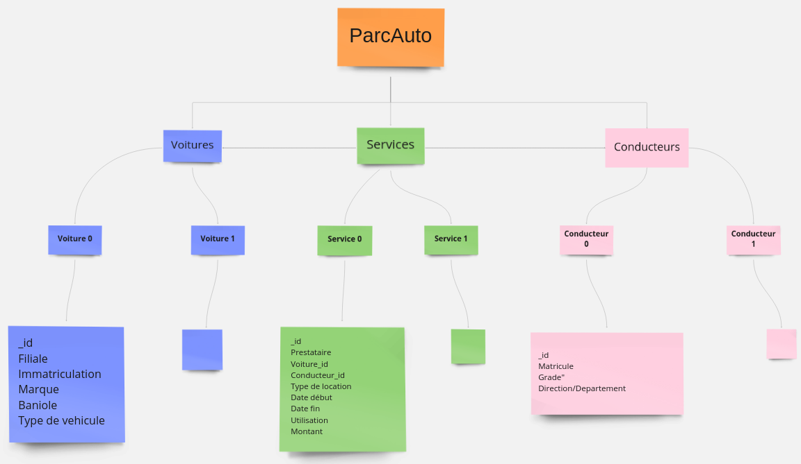

# Data Model for Parc Auto Project
---
* We have 3 Collections

```JSON
"Conducteurs": {
	"conducteur": {
		"_id": <ObjectId>,
		"matricule": <String>,
		"grade": <String>,
		"direction/departement": <String>
	},
}

"Voitures": {
	"voiture": {
		"_id": <ObjectId>,
		"filiale": <String>,
		"immatriculation": <String>,
		"marque": <String>,
		"baniole": <Boolean>,
		"type de vehicule": <String>
	},
}


"Services": {
	"Service": {
		"_id": <ObjectId>,
		"Prestataire":<String>,
		"voiture_id": [<ObjectId>,],
		"conducteur_id": [<ObjectId>,],
		"type de location": <String>,
		"Date debut": <Date>,
		"Date fin": <Date>,
		"utilisation": <String>,
		"montant": <Double>
	},
}
```
* A map of our Data Model :


<p align="center">
	
</p>


<!--  -->